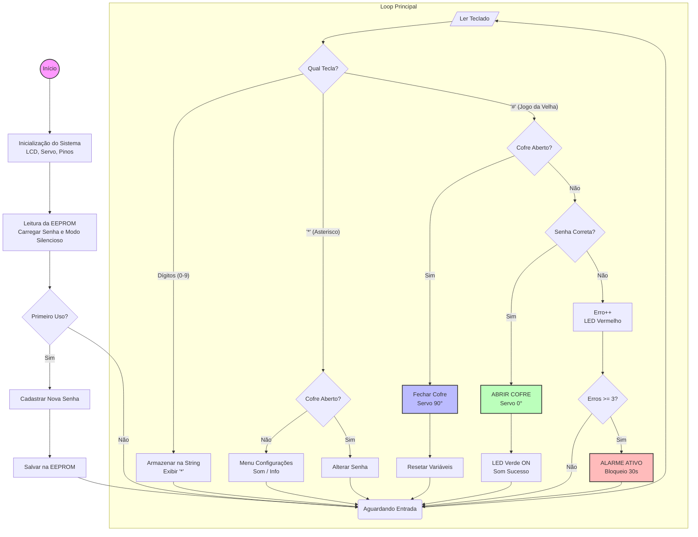

# 🔐 Cofre Eletrônico Microcontrolado com Arduino

Este repositório contém o desenvolvimento completo de um **Cofre Eletrônico Microcontrolado**, construído com **Arduino Uno R3**, interface com **LCD 16×2 I2C**, **teclado matricial 4×3**, **servo motor SG90**, LEDs e buzzer para feedback do usuário.  
O projeto inclui um **gabinete customizado impresso em 3D** e diversas funcionalidades de segurança implementadas em C++.

---

## 📌 Funcionalidades Principais

- **Senha de 4 dígitos** com persistência em EEPROM  
- **Configuração inicial obrigatória** (senha não definida → sistema exige cadastro)
- **Alteração de senha** com dupla confirmação
- **3 tentativas erradas → bloqueio automático de 30 segundos**
- **Alarme não-bloqueante** (LED vermelho + buzzer intermitente)
- **Timeout de inatividade** ao digitar a senha (30s)
- **Menu de usuário**:
  - Ativar/desativar modo silencioso
  - Informações do sistema (estado do som + número de erros)
- **Trava mecânica** acionada por servo motor e sistema de arame em “L”
- **Gabinete impresso em 3D**, incluindo tampa frontal articulada e tampas internas

---

## 🛠️ Hardware Utilizado

| Componente | Quantidade |
|-----------|------------|
| Arduino Uno R3 | 1 |
| LCD 16x2 com I2C | 1 |
| Teclado Matricial 4×3 | 1 |
| Servo Motor SG90 | 1 |
| Buzzer Passivo | 1 |
| LEDs (vermelho e verde) | 2 |
| Resistores 220Ω | 3 |
| Jumpers F/F e M/M | Diversos |
| Caixa em impressão 3D | 1 |

---

## 📁 Estrutura do Repositório

```
📦 projeto-cofre-eletronico
├── src/
│ └── cofre.ino # Código completo do Arduino
├── docs/
│ ├── esquema-eletrico.png # Esquema de ligação (Tinkercad)
│ ├── montagem-3d.png # Modelo da caixa 3D
│ └── fluxograma.png # Fluxograma do sistema
└── README.md
```

---

## ⚙️ Como o Sistema Funciona

### 🔹 **1. Inicialização**
- Verifica se existe senha salva na EEPROM.
- Se não existir, o sistema exige um **cadastro inicial** antes de permitir o uso.

### 🔹 **2. Digitação da Senha**
- O usuário digita quatro dígitos.
- Pressiona `#` para confirmar.
- O LCD exibe `*` para cada tecla pressionada.

### 🔹 **3. Acesso Liberado**
- LED verde acende.
- Servo gira para posição de “destrancar”.
- Uma animação de fechamento aparece ao pressionar `#`.

### 🔹 **4. Segurança**
- Três erros consecutivos ativam:
  - Alarme sonoro
  - LED vermelho piscando
  - Bloqueio de 30 segundos
- Timeout cancela digitação após 30s sem interação.

### 🔹 **5. Menu Geral**
Com o cofre fechado, pressione `*`:
1. Ativar/desativar som  
2. Exibir informações do sistema  
`#` → Sair

---

## 🧩 Fluxograma do Sistema




## 💻 Código-Fonte

O código completo se encontra em:

`/src/cofre.ino`

> Inclui todas as rotinas: senha, EEPROM, alarme, menu, animações, timeout e controle do servo.

## 🧪 Resultados

- Sistema operou de forma estável e confiável
- Interface intuitiva via LCD + teclado
- Alarme eficiente e não-bloqueante
- Trava mecânica robusta
- Caixa 3D permitiu excelente organização interna
- Projeto final atendeu a todos os requisitos da disciplina

## 🚀 Possíveis Melhorias Futuras

- Integração com Wi-Fi (ESP32) para monitoramento remoto
- Aplicativo mobile para abertura via Bluetooth
- Sensor biométrico (digital)
- Registro de logs de acesso
- Trava metálica mais robusta

## 👥 Autores

- Danilo Costa Bento
- José Victor Contierro
- Leonardo Lopes Corrêa
- Letícia de Lima Silva
- Renan dos Santos Souza

## 📄 Licença

Licenciado sob **MIT License**.

Sinta-se livre para modificar, melhorar ou utilizar este projeto para fins didáticos.
